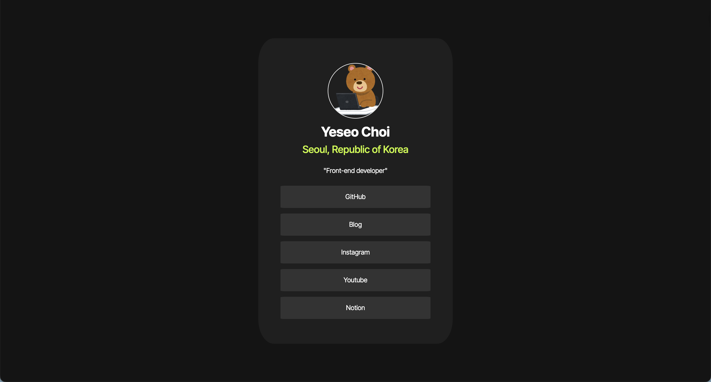

## The challenge



## Built With
- html, css
- flex box Layout

## What I learned

### ✅ title
`<a href="#" target="_blank" title="move to GitHub">GitHub</a>`
title은 요소에 대한 설명이나 추가 정보를 제공함.
마우스를 해당 요소에 올렸을 떄 툴팁 형태로 나타남.

---

### ✅ display
: 요소의 배치 방식을 결정하는 CSS 속성

주요 값들:
- block<br/>
  블록 레벨 요소로 설정.
  기본적으로 새로운 줄에서 시작하고, 전체 가로 공간을 차지함.<br/>
  예시: `<div>, <p>, <h1>` 등.

- inline<br/>
  인라인 요소로 설정.
  새로운 줄에서 시작하지 않고, 요소가 차지하는 크기만큼만 공간을 사용함.<br/>
  예시: `<span>, <a>, <strong>` 등.

  - inline-block<br/>
  인라인처럼 흐름에 따라 배치되지만, 블록처럼 너비와 높이를 설정할 수 있음.<br/>
  예시: 버튼, 이미지 등이 자주 사용함.
  
- flex<br/>
  플렉스 컨테이너로 설정.
  자식 요소들을 유연하게 배치하고 정렬할 수 있게 해줌.<br/>
  예시: `display: flex;`를 부모 요소에 설정하면, 직속 자식 요소들이 플렉스 아이템이 됨. 

- grid<br/>
  그리드 레이아웃으로 설정.
  2차원 배열 형태로 자식 요소들을 정렬하고 배치할 수 있음.<br/>
  예시: `display: grid;`로 그리드 컨테이너 설정.

- none<br/>
  요소를 화면에서 아예 보이지 않게 만들며, 요소가 레이아웃에서 차지하는 공간도 없어진다.<br/>
  예시: 특정 요소를 숨기고 싶을 때 사용.

### ✅ flex-direction: 주축 방향을 결정
`flex-direction: column` : 주축 자체를 세로 방향으로 바꿈. 따라서 아이템들이 위에서 아래로 쌓이게 됨.

플렉스 박스에서 주축과 교차축은 flex-direction 속성에 따라 바뀜.
- row (기본값)일 때
  주축: 수평 (왼 -> 오)
  교차축: 수직 (위 -> 아래)

- column일 때
  주축: 수직 (위 -> 아래)
  교차축: 수평 (왼 -> 오)

### ✅ justify-content
: 플렉스 아이템을 주축 방향으로 정렬할 때 사용하는 속성.

### ✅ align-items
: 플렉스 박스에서 교차축 방향으로 아이템들을 정렬할 때 사용하는 속성

### ✅ justify content과 align-items
둘은 세트처럼 자주 같이 쓴다.
특히, 가운데 정렬할 때 많이 사용한다.

```css
.container {
  display: flex;
  justify-content: center; /* 세로 중앙 */
  align-items: center; /* 가로 중앙 */
}
```
=> 결과: 아이템(직속 자식 요소)들이 가로 + 세로 + 중앙 정렬된다. => 브라우저 화면의 한 가운데에 배치됨

### ✅ hsl
색상을 표현하는 방법. Hue(색상), Saturation(채도), Lightness(명도)의 약자임. 
```css
  background-color:hsl(0, 0%, 8%); /* hsl(색상,채도,밝기) */
```

### ✅ border-radius
요소의 모서리를 둥글게 만드는 속성
이때 퍼센트 값은 요소의 크기에 비례해서 둥글게 만들어짐.

### ✅ letter-spacing과 line-height
- letter-spacing: 텍스트의 자간, 즉 글자 사이의 간격을 조정하는 속성
- line-height: 텍스트의 세로 간격을 조절하는 속성
